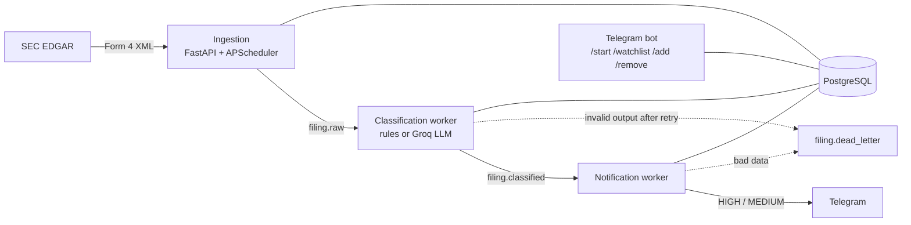

# FilingBot


[](#)
[](#)


> Event-driven pipeline that monitors SEC EDGAR for insider trades, scores each one, and alerts on Telegram.

**Status:** live on Oracle Cloud since October 2026 and <u> in active development</u>

---

## What It Does

When a corporate insider (CEO, CFO, director) buys or sells their company's stock, they must file a **Form 4** with the SEC within two business days. The filings are public, but they arrive as thousands of XML documents a day, and most of them are routine compensation rather than real trades.

FilingBot filters that stream down to the trades worth knowing about:

1. **Polls** SEC EDGAR every 5 minutes for new Form 4 filings and parses the XML.
2. **Scores** each transaction: deterministic rules for stock grants and tax withholding, an LLM for discretionary trades.
3. **Alerts** users on Telegram for HIGH and MEDIUM signals only, across all companies or a personal watchlist.

### By the numbers

- **570+** live filings processed since launch
- **67%** fewer LLM calls, measured across 572 production filings
- **77%** smaller container image (1.8 GB → 427 MB)

---

## Architecture



Each stage runs in its own Docker container. Stages communicate only through **Redis Streams** with consumer groups, and a worker acknowledges a message only after it has finished processing it. Every filing's pipeline status is tracked in PostgreSQL.

---

## Tech Stack

| Layer | Technology |
|---|---|
| Backend | Python 3.11, FastAPI (async), APScheduler |
| Message bus | Redis Streams (consumer groups + XACK) |
| Database | PostgreSQL 16, SQLAlchemy async, Alembic |
| LLM | Groq API (gpt-oss-120b), strict JSON-schema output |
| Bot | python-telegram-bot (async) |
| Parsing | lxml / XPath |
| Observability | Sentry, structured JSON logging |
| Deployment | Docker Compose on an Oracle Cloud ARM VM |
| Quality | pytest, ruff, pre-commit, GitHub Actions |

---

## Key Engineering Decisions

- **Redis Streams over Celery or RabbitMQ.** Durable streams with explicit acks and one consumer group per worker. Replicas share a group with no extra config, because each container's hostname is its consumer name.
- **Rules where the answer is fixed, an LLM where judgment is needed.** Stock grants and tax withholding happen *to* an insider, never by their choice. Across 572 production filings they produced zero HIGH or MEDIUM signals, so they're scored by rule and never sent to the LLM.
- **Validated LLM output.** Groq returns JSON constrained to the Pydantic model's schema. A response that still fails validation gets one corrective retry, then goes to the `filing.dead_letter` stream.
- **Idempotent ingestion.** A unique constraint on the SEC accession number means a filing seen twice is stored once.
- **Expected skips aren't errors.** Options-only filings and unlisted issuers are skipped and logged. Malformed filings still raise and reach Sentry, so the alert channel stays meaningful.
- **Explicit alert scope.** `/start` asks whether a user wants every company or a custom watchlist, stored as its own flag. An empty watchlist is never read as "everything".
- **Observability in every service.** Sentry is tagged by service and environment. JSON logs carry `correlation_id = accession_number`, and every LLM call logs its token usage against the daily quota.
- **Respectful SEC access.** EDGAR requests carry the required User-Agent and are concurrency-capped with an `asyncio.Semaphore`.
- **Locked-down deployment.** Postgres and Redis publish no ports, and secrets live in `.env`, which `.dockerignore` keeps out of every image.

---

## Running Locally

Requires Docker, a Telegram bot token from [@BotFather](https://t.me/BotFather), and a [Groq API key](https://console.groq.com).

```bash
cp .env.example .env                                     # fill in your own keys
docker compose up -d postgres redis
docker compose run --rm ingestion alembic upgrade head   # create the schema
docker compose up -d --build
```

Run the tests:

```bash
pip install -r requirements.txt
pytest
```

---


## Project Structure

```
filingbot/
├── docker-compose.yml
├── core/
│   ├── schemas/             # Pydantic models and enums
│   ├── database/            # SQLAlchemy models + async session
│   ├── redis_client.py      # publish / consume / ack / dead-letter
│   ├── config.py            # pydantic-settings, reads .env
│   ├── logging_config.py    # structured JSON logger
│   ├── sentry_config.py     # Sentry init, tagged per service
│   └── ticker_directory.py  # SEC ticker list for /add validation
├── ingestion/               # FastAPI + APScheduler, EDGAR poller, Form 4 parser
├── workers/
│   ├── classification/      # rules + Groq classifier, insider history
│   └── notification/        # alert formatting + Telegram delivery
├── telegram_bot/            # bot entry point, commands, messages
├── alembic/                 # database migrations
└── tests/
```

---

*Portfolio project by Priel Krishtal. Started April 2026, live since October 2026.*
